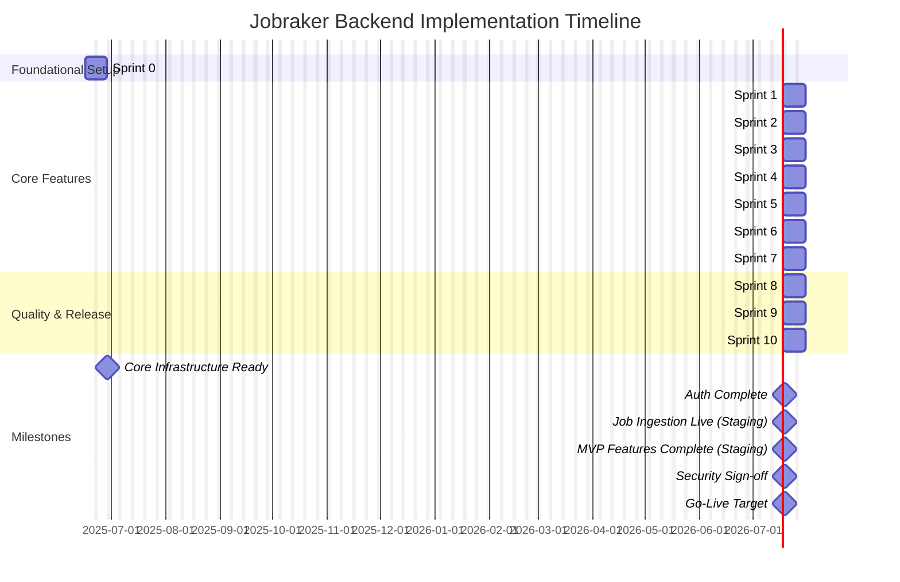

# Jobraker — Implementation Blueprint & Delivery Plan

**Version:** 1.1  
**Last Updated:** June 15, 2025  
**Status:** Final

## 0. Document Control

| Version | Date          | Author(s)       | Summary of Changes                                                                 |
| :------ | :------------ | :-------------- | :--------------------------------------------------------------------------------- |
| 1.0     | June 15, 2025 | AI Assistant    | Initial draft based on user-provided content.                                      |
| 1.1     | June 15, 2025 | AI Assistant    | Enhanced professionalism, detail, and structure. Added sections for Executive Summary, Dependencies, Communication Plan, and refined existing content. |

---

## Executive Summary

This Implementation Blueprint and Delivery Plan outlines the strategic approach for developing and deploying the Jobraker backend system. It details a 10-sprint (20-week) plan, commencing with foundational environment setup and culminating in a production roll-out on the Render PaaS. The plan emphasizes agile methodologies, robust testing, continuous integration/continuous deployment (CI/CD), and proactive risk management. Key deliverables include core user authentication, job ingestion and semantic matching, automated application submission, an AI-powered chat assistant, and comprehensive analytics. This document serves as a central guide for all stakeholders, ensuring alignment and a clear path to achieving Jobraker's vision of an autonomous job search platform.

---

## 1. Purpose of this Document

This blueprint translates the high-level architecture of the Jobraker backend system into a concrete, actionable plan. It defines the scope of work, activities, timelines, resource allocation (roles and responsibilities), and key performance indicators (KPIs) necessary for the successful launch and initial operation of Jobraker’s backend infrastructure on the Render platform. It is intended for a diverse audience, including software engineers, DevOps specialists, product owners, project managers, and security/compliance stakeholders, providing a shared understanding of the implementation strategy and delivery commitments.

---

## 2. Guiding Principles & Development Philosophy

Our development process is underpinned by the following core principles to ensure quality, agility, and resilience:

| Principle                 | Implementation Tactic & Rationale                                                                                                                               |
| :------------------------ | :-------------------------------------------------------------------------------------------------------------------------------------------------------------- |
| Iterate Safely & Rapidly  | Employ short, vertical slices of functionality, enabling frequent integration and feedback. Utilize feature flags and canary releases for controlled rollouts and risk mitigation. |
| Asynchronous by Default   | Mandate that any operation involving network I/O or with an execution time potentially exceeding 250ms be processed asynchronously via Celery. This preserves API responsiveness and enhances user experience. |
| Observability First       | Embed telemetry hooks (e.g., Prometheus client, Sentry SDK) as an integral part of every new service or significant feature. Comprehensive observability is non-negotiable for proactive issue detection and performance analysis. |
| Shift-Left on Security    | Integrate security practices early in the development lifecycle. This includes automated static analysis (e.g., Bandit), secrets scanning, and Row-Level Security (RLS) tests as part of the CI pipeline. |
| Cost Awareness & Optimization | Implement mechanisms for daily tracking of OpenAI and Render service expenditures, with data visualized in Grafana. Configure automated alerts when spending approaches 80% of the allocated budget to ensure financial prudence. |
| Test-Driven Development (TDD) | Encourage writing tests before or alongside feature code to ensure correctness and facilitate refactoring. Aim for high test coverage across unit, integration, and E2E tests. |
| Infrastructure as Code (IaC) | Manage and provision all cloud infrastructure (Render services, configurations) through version-controlled code (e.g., `render.yaml`) to ensure consistency, repeatability, and auditability. |
| Continuous Improvement    | Foster a culture of regular retrospectives and knowledge sharing to identify areas for process improvement, technological enhancements, and skill development. |

---

## 3. Team Composition & Role Definitions

A dedicated, cross-functional team is essential for the successful delivery of the Jobraker platform. The following roles and responsibilities are defined:

| Role                          | Key Responsibilities & Expertise                                                                                                                               |
| :---------------------------- | :------------------------------------------------------------------------------------------------------------------------------------------------------------- |
| Tech Lead                     | Owns the architectural integrity and technical vision. Oversees code reviews, mentors engineers, resolves technical roadblocks, and ensures adherence to best practices. |
| Backend Software Engineers (3)| Design, develop, and maintain Django applications, Celery tasks, `pgvector` queries, and associated unit/integration tests. Collaborate on API design and data modeling. |
| DevOps Engineer               | Manages Render infrastructure-as-code (`render.yaml`). Develops and maintains the CI/CD pipeline. Implements and manages the logging, monitoring, and alerting stack. Ensures platform reliability and scalability. |
| Quality Assurance (QA) Engineer | Develops and executes the overall test strategy and plan. Creates and maintains automated test suites (unit, integration, E2E). Conducts load testing, performance testing, and exploratory testing. |
| Product Owner                 | Represents the voice of the customer. Defines and prioritizes the product backlog. Writes user stories and acceptance criteria. Validates and accepts completed features. |
| Security Officer (Part-time)  | Conducts threat modeling sessions. Oversees security assessments and penetration tests. Ensures compliance with relevant data protection regulations (e.g., GDPR). Provides security sign-off for releases. |
| Project Manager (Optional)    | Facilitates sprint planning, daily stand-ups, and retrospectives. Tracks progress against the timeline. Manages risks and dependencies. Facilitates communication between stakeholders. |

---

## 4. Detailed Work-stream Breakdown & Sprint Plan

This section outlines the planned sprints, key tasks within each sprint, ownership, and specific acceptance criteria. Each sprint is assumed to be two weeks in duration.

### 4.1 Foundational Environment & CI/CD Setup (Sprint 0)
*Objective: Establish the core development infrastructure and CI/CD pipeline.* 

| Task ID | Task Description                                                                 | Owner     | Acceptance Criteria                                                                                                | Dependencies |
| :------ | :------------------------------------------------------------------------------- | :-------- | :----------------------------------------------------------------------------------------------------------------- | :----------- |
| S0.1    | Bootstrap GitHub repository with `main`/`develop` branches, PR templates, CODEOWNERS. | Tech Lead | Repository created; PR template enforces conventional commits; CODEOWNERS file specifies review responsibilities. | -            |
| S0.2    | Provision Render services: Web Service, Worker, Beat, PostgreSQL, Redis.         | DevOps    | All services provisioned on Render; `/healthz` endpoint returns HTTP 200 for each service.                         | -            |
| S0.3    | Implement initial CI pipeline: `pytest` (unit tests), `ruff` (linting), `bandit` (security). | DevOps    | CI pipeline configured (e.g., GitHub Actions); build fails if tests fail or critical linting/security issues found. | S0.1         |
| S0.4    | Integrate `django-jazzmin` for admin UI; apply minimal `JAZZMIN_SETTINGS`.       | Backend#1 | Django admin accessible; landing page styled with "Jobraker" branding; basic navigation functional.                | S0.2         |

### 4.2 Core Account Management & Authentication (Sprint 1)
*Objective: Implement user registration, authentication, and profile management.* 

| Task ID | Task Description                                                                 | Owner     | Acceptance Criteria                                                                                                                              | Dependencies |
| :------ | :------------------------------------------------------------------------------- | :-------- | :----------------------------------------------------------------------------------------------------------------------------------------------- | :----------- |
| S1.1    | Extend Django `User` model to `UserProfile` (fields: resume URL, match threshold, `vector` field for profile embedding, auto-apply preferences). | Backend#1 | Migrations created and applied; `UserProfile` model includes all specified fields; `vector` field configured for `pgvector`.                     | S0.2         |
| S1.2    | Implement JWT-based authentication using `djangorestframework-simplejwt`.        | Backend#2 | Endpoints for token_obtain_pair, token_refresh, token_verify functional; tokens issued and validated successfully.                               | S0.3         |
| S1.3    | Integrate OAuth2 (Google, LinkedIn) using `django-allauth`.                      | Backend#3 | Users can register/login via Google and LinkedIn; user data from providers correctly mapped to `User` and `UserProfile`.                       | S1.1, S1.2   |
| S1.4    | Develop unit tests for registration, login, token refresh, profile CRUD, and RLS (user cannot read/write peer profiles). | All Backend | Test coverage for `accounts` app > 80%; RLS tests confirm data isolation; Postman collection for auth endpoints passes. Bandit scan result "Low". | S1.1, S1.2, S1.3 |

### 4.3 External Integration Framework (Sprint 2)
*Objective: Build a secure and extensible framework for managing third-party integrations.* 

| Task ID | Task Description                                                                 | Owner     | Acceptance Criteria                                                                                                                               | Dependencies |
| :------ | :------------------------------------------------------------------------------- | :-------- | :------------------------------------------------------------------------------------------------------------------------------------------------ | :----------- |
| S2.1    | Define `Integration` model (fields: provider name, encrypted credentials, status, last_synced_at). Use AES encryption for credentials. | Backend#1 | Model created; migrations applied; credentials field uses `django-fernet-fields` or similar for encryption.                                       | S0.2         |
| S2.2    | Develop CRUD API endpoints for managing `Integration` records (admin-only or user-specific based on integration type). | Backend#2 | Endpoints functional; appropriate permissions enforced; secrets validation (e.g., test connection on save) implemented.                               | S2.1         |
| S2.3    | Create Celery task skeletons for key integrations (e.g., `sync_adzuna_data`, `call_skyvern_api`, `query_openai_model`). Tasks are no-op initially. | Backend#3 | Celery tasks defined in `tasks.py`; can be enqueued and "run" successfully (logging a "noop" message).                                            | S0.2, S0.3   |

### 4.4 Adzuna Job Ingestion & Semantic Embedding (Sprint 3)
*Objective: Ingest job listings from Adzuna and generate embeddings for semantic search.* 

| Task ID | Task Description                                                                 | Owner     | Acceptance Criteria                                                                                                                                                              | Dependencies |
| :------ | :------------------------------------------------------------------------------- | :-------- | :------------------------------------------------------------------------------------------------------------------------------------------------------------------------------- | :----------- |
| S3.1    | Implement `fetch_adzuna_jobs` Celery worker: handles pagination, performs idempotent upserts to `JobListing` model, stores original JSON payload. | Backend#1 | Task fetches jobs from Adzuna sandbox/API; data correctly mapped to `JobListing` model; duplicates handled via upsert logic; original Adzuna payload stored.                     | S2.1, S2.3   |
| S3.2    | Implement Embedding Phase 1: In `fetch_adzuna_jobs` task, call OpenAI `text-embedding-3-small` API for job descriptions; store resulting vector in `job.embedding` field. | Backend#2 | Embeddings generated for new/updated jobs; vectors stored in `pgvector` compatible field. OpenAI API key managed securely.                                                              | S3.1         |
| S3.3    | Create `pgvector` index on `job.embedding`: `CREATE INDEX job_embedding_ivf ON job USING ivfflat(embedding vector_cosine_ops) WITH (lists=200);` | DevOps, Backend#1 | Index created in PostgreSQL; migration file includes index creation. Load-test with 20k rows shows p95 semantic search query time < 200 ms.                                              | S3.2         |

### 4.5 Job Matching API & Manual Application Workflow (Sprint 4)
*Objective: Enable users to search for jobs with match scores and manually apply.* 

| Task ID | Task Description                                                                 | Owner     | Acceptance Criteria                                                                                                                                                             | Dependencies |
| :------ | :------------------------------------------------------------------------------- | :-------- | :------------------------------------------------------------------------------------------------------------------------------------------------------------------------------ | :----------- |
| S4.1    | Develop `/api/v1/jobs/search/` GET endpoint; annotate results with `match_score` (cosine similarity between user profile vector and job embedding vector using `pgvector`). | Backend#1 | Endpoint returns job listings; `match_score` correctly calculated and included in response. Filtering and pagination functional.                                                  | S1.1, S3.3   |
| S4.2    | Develop `/api/v1/applications/` POST endpoint for manual applications; create `Application` record with `status = 'pending_manual_submission'`. | Backend#2 | Endpoint creates `Application` record; links to `User` and `JobListing`; initial status set correctly.                                                                          | S1.1, S3.1   |
| S4.3    | Implement Celery task `submit_manual_application` to call Skyvern API. Implement Skyvern webhook receiver to update `Application.status`. | Backend#3 | Task sends application data to Skyvern sandbox; webhook successfully receives status updates from Skyvern and updates `Application` record. Secure Skyvern API key handling. | S2.3, S4.2   |
| S4.4    | Create `Notification` record upon application status change. Demonstrate WebSocket push for real-time notification to user (basic demo). | Backend#1 | `Notification` created in DB; basic WebSocket connection established; client receives notification message.                                                                     | S4.3         |

### 4.6 Automated Job Application Engine (Sprint 5)
*Objective: Implement the core auto-apply functionality.* 

| Task ID | Task Description                                                                 | Owner     | Acceptance Criteria                                                                                                                                                              | Dependencies |
| :------ | :------------------------------------------------------------------------------- | :-------- | :------------------------------------------------------------------------------------------------------------------------------------------------------------------------------- | :----------- |
| S5.1    | Implement hourly Celery Beat task `auto_apply_jobs`: filters jobs by user's match threshold, ensures no duplicate applications for same user/job. | Backend#2 | Task runs hourly; correctly identifies eligible jobs based on user profile settings and `match_score`; avoids re-applying to already processed jobs.                               | S1.1, S4.1   |
| S5.2    | Implement idempotency for application submission using key: `f"{profile_id}:{job_id}"`. | Backend#2 | Submitting the same application multiple times (e.g., due to retries) results in only one actual submission attempt to Skyvern.                                                  | S5.1         |
| S5.3    | Implement back-pressure mechanism: feature flag to pause `auto_apply_jobs` if Celery queue depth for Skyvern tasks exceeds 50k items. | DevOps, Backend#3 | Feature flag functional; auto-apply task checks queue depth and pauses if threshold exceeded; admin alert triggered.                                                              | S5.1         |
| S5.4    | Conduct E2E test of auto-apply flow using a sandbox Skyvern endpoint and mock user profiles. | QA, Backend#3 | Auto-apply successfully submits applications to sandbox; `Application` records created with correct status; notifications triggered.                                                | S5.1, S5.2   |

### 4.7 AI Chat Assistant MVP (Sprint 6)
*Objective: Launch a minimum viable product for the AI-powered chat assistant.* 

| Task ID | Task Description                                                                 | Owner     | Acceptance Criteria                                                                                                                                                             | Dependencies |
| :------ | :------------------------------------------------------------------------------- | :-------- | :------------------------------------------------------------------------------------------------------------------------------------------------------------------------------ | :----------- |
| S6.1    | Develop `/api/v1/chat/messages/` CRUD endpoints. Implement basic WebSocket stub for real-time message delivery (optional, can be polling initially). | Backend#1 | Endpoints for sending and retrieving chat messages functional; messages persisted to `ChatMessage` model. Basic WebSocket connection for chat functional or polling mechanism in place. | S1.1         |
| S6.2    | Implement Celery task `generate_ai_chat_response` using Retrieval Augmented Generation (RAG) with OpenAI. Define "tools" for RAG (e.g., get user profile, list applications). | Backend#2 | Task takes user message, retrieves context using defined tools, constructs prompt, calls OpenAI API, and returns response. Secure OpenAI API key handling.                         | S2.3, S1.1, S4.2 |
| S6.3    | Implement spend guard: track OpenAI token usage per user (or user tier) per day; log/alert if limits approached. | Backend#3 | Token usage tracked; alerts generated if daily limits are close to being breached. Fallback to simpler model or message if limit exceeded.                                        | S6.2         |
| S6.4    | Add Prometheus counters for AI chat latency (OpenAI API call time, total task time) and message volume. | DevOps, Backend#2 | Metrics exported to Prometheus; visible in Grafana dashboards.                                                                                                                    | S0.3, S6.2   |

### 4.8 Analytics Dashboard & Reporting (Sprint 7)
*Objective: Provide basic analytics and reporting capabilities for platform administrators.* 

| Task ID | Task Description                                                                 | Owner     | Acceptance Criteria                                                                                                                                                             | Dependencies |
| :------ | :------------------------------------------------------------------------------- | :-------- | :------------------------------------------------------------------------------------------------------------------------------------------------------------------------------ | :----------- |
| S7.1    | Develop database aggregation queries for key metrics (e.g., new users, jobs ingested, applications submitted (manual vs. auto), interview invites). | Backend#1 | SQL queries defined and optimized; accurately reflect the required metrics.                                                                                                     | S1.1, S3.1, S4.2 |
| S7.2    | Implement PostgreSQL Views or Materialized Views for computationally heavy KPI queries to improve performance. | Backend#1 | Views created for complex aggregations; Materialized Views refreshed periodically (e.g., hourly).                                                                               | S7.1         |
| S7.3    | Create `/api/v1/analytics/` endpoint for admin dashboard; cache responses in Redis for 5 minutes. | Backend#2 | Endpoint returns aggregated analytics data; response cached in Redis with appropriate TTL; admin permissions enforced.                                                            | S7.1, S7.2   |

### 4.9 Security Hardening & Compliance Checks (Sprint 8)
*Objective: Perform comprehensive security testing and ensure compliance readiness.* 

| Task ID | Task Description                                                                 | Owner          | Acceptance Criteria                                                                                                                                                              | Dependencies |
| :------ | :------------------------------------------------------------------------------- | :------------- | :------------------------------------------------------------------------------------------------------------------------------------------------------------------------------- | :----------- |
| S8.1    | Conduct static code analysis using `Bandit` and `Safety` (for vulnerable dependencies). Integrate into CI. | DevOps, SecOff | All critical/high severity issues identified by Bandit and Safety addressed or explicitly accepted with justification. CI pipeline includes these checks.                               | S0.3         |
| S8.2    | Implement `Renovatebot` or similar for automated dependency update PRs.          | DevOps         | Renovatebot configured; automatically creates PRs for outdated dependencies; PRs include changelogs and test results.                                                              | S0.1         |
| S8.3    | Perform initial penetration testing using OWASP ZAP (scripted scan) against a staging environment. | QA, SecOff     | ZAP scan completed; report generated; critical/high vulnerabilities identified are triaged and planned for remediation.                                                              | All previous sprints |
| S8.4    | Validate GDPR compliance: implement and test data export and account deletion endpoints. | Backend#3, SecOff | Endpoints for user data export (JSON/CSV) and account deletion (hard delete or anonymization) are functional and tested. Data processing agreements reviewed.                     | S1.1         |

### 4.10 Load Testing & Chaos Engineering Experiments (Sprint 9)
*Objective: Validate system performance under load and resilience to failures.* 

| Task ID | Task Description                                                                 | Owner         | Acceptance Criteria                                                                                                                                                             | Dependencies |
| :------ | :------------------------------------------------------------------------------- | :------------ | :------------------------------------------------------------------------------------------------------------------------------------------------------------------------------ | :----------- |
| S9.1    | Develop Locust load testing scripts for key API endpoints (`/jobs/`, `/applications/`, `/chat/`). Simulate 10,000 Virtual Users (VUs). | QA, DevOps    | Locust scripts cover main user flows; test environment configured to handle 10k VUs.                                                                                              | All previous API sprints |
| S9.2    | Execute load tests; identify and address performance bottlenecks. Target SLA: API p95 latency < 300 ms, error rate < 0.1 %. | QA, DevOps, All Backend | Load tests run successfully; performance metrics meet defined SLAs. Bottlenecks (if any) identified and remediation plan in place.                                                | S9.1         |
| S9.3    | Conduct chaos engineering experiment: manually terminate a Celery worker pod during active task processing. | DevOps, QA    | System remains stable; pending tasks are picked up by other workers; queue drains within an acceptable timeframe (e.g., < 5 minutes). No data loss.                                  | S0.2, S4.3, S5.1 |
| S9.4    | User Acceptance Testing (UAT) with internal stakeholders on staging environment. | Product Owner, QA | Key user flows validated by stakeholders; feedback collected and triaged. All critical/major UAT issues resolved.                                                               | All previous sprints |

### 4.11 Production Roll-out & Go-Live (Sprint 10)
*Objective: Deploy Jobraker to production and transition to operational monitoring.* 

| Task ID | Task Description                                                                 | Owner     | Acceptance Criteria                                                                                                                                                             | Dependencies |
| :------ | :------------------------------------------------------------------------------- | :-------- | :------------------------------------------------------------------------------------------------------------------------------------------------------------------------------ | :----------- |
| S10.1   | Finalize production `render.yaml` configuration. Ensure all feature flags (especially for auto-apply and new integrations) default to OFF. | DevOps    | Production environment configuration validated. Feature flags reviewed and set to safe defaults.                                                                                  | All previous sprints |
| S10.2   | Execute canary release strategy: deploy to production, route 5% of traffic for 24 hours. Monitor key metrics (error rates, latency, resource utilization). | DevOps, Tech Lead | Canary deployment successful; monitoring dashboards show stable performance and no critical errors for the 5% traffic.                                                              | S10.1        |
| S10.3   | Gradually increase traffic to 50%, then 100% if canary metrics remain stable.    | DevOps    | Traffic successfully ramped up to 100%; platform remains stable and performant under full load.                                                                                   | S10.2        |
| S10.4   | Conduct post-launch retrospective and initial cost review against budget.        | All Team  | Retrospective meeting held; lessons learned documented. Initial cloud spend (Render, OpenAI) analyzed and compared to projections.                                                  | S10.3        |

---

## 5. Master Timeline & Gantt Chart (Conceptual)

This Gantt chart provides a high-level visual representation of the 10-sprint (20-week) project timeline.

**Assumptions:** Each sprint is 2 weeks. Project start date: June 16, 2025.
**Go-Live Target:** Approximately 20 weeks from project start (End of October 2025).

---

## 6. Comprehensive Testing Strategy & Matrix

A multi-layered testing strategy is crucial for ensuring the quality, reliability, and security of the Jobraker platform.

| Testing Layer     | Tools & Frameworks                     | Coverage Goal | Key Areas & Examples                                                                                                | Owner       |
| :---------------- | :------------------------------------- | :------------ | :------------------------------------------------------------------------------------------------------------------ | :---------- |
| **Unit Testing**  | `pytest`, `unittest.mock`              | > 90%         | Models (validation, methods), Services (business logic), Helpers, Utils. Mock external dependencies.                | Backend Eng |
| **Integration Testing** | `pytest`, `APIClient` (DRF), `testcontainers` (Postgres, Redis), `Celery` (testing utilities) | > 70%         | API endpoint behavior, service interactions, Celery task execution with real broker/DB, RLS enforcement.             | Backend Eng |
| **End-to-End (E2E) Testing** | `Cypress` (frontend-driven), `Playwright` (Python-driven for specific backend flows) | Key User Flows | User registration & login, job search & manual apply, auto-apply (mocked Skyvern), AI chat interaction, admin functions. | QA Engineer |
| **Load Testing**  | `Locust`                               | Target SLA    | API endpoint performance under concurrent load (p95 latency, error rates), Celery worker scalability.               | QA, DevOps  |
| **Security Testing** | `Bandit` (SAST), `Safety` (dependencies), `OWASP ZAP` (DAST), Manual Pen-Testing (external) | Critical/High Vulns = 0 | SQLi, XSS, auth/authz bypass, insecure direct object references, prompt injection, sensitive data exposure.         | SecOff, QA  |
| **Contract Testing** | `Pact` (or similar, if frontend/microservices adopt) | API Contracts | Ensure backend API changes don't break frontend consumers (and vice-versa if applicable).                             | Backend, Frontend |
| **Chaos Engineering** | Manual experiments, potentially `Chaos Toolkit` later | Key Services  | Resilience of Celery workers, database connections, external API integrations to transient failures.                  | DevOps, QA  |

**Testing Pyramid:** Emphasis on a strong base of unit tests, followed by integration tests, with fewer, more targeted E2E tests.

---

## 7. Configuration Management & Infrastructure as Code (IaC)

Effective configuration management and IaC are vital for consistency, repeatability, and operational efficiency.

| Item                        | Tool / Approach                                                                                                | Responsibility | Notes                                                                                                                               |
| :-------------------------- | :------------------------------------------------------------------------------------------------------------- | :------------- | :---------------------------------------------------------------------------------------------------------------------------------- |
| **Render Service Definition** | `render.yaml` file stored in the root of the GitHub repository.                                                | DevOps         | Defines all services (web, worker, beat), build commands, start commands, health checks, scaling rules, environment groups. Blue/green deployment strategy preferred. |
| **Environment Variables & Secrets** | Render Environment Groups (for staging/production). Local development uses `.env` files (gitignored) loaded by `python-dotenv` or `.envrc` with `direnv`. | DevOps, All Eng | Secrets (API keys, DB passwords) are never hardcoded. Environment Groups provide secure storage and injection at runtime.                 |
| **Database Schema Management** | Django Migrations (`python manage.py makemigrations`, `migrate`).                                                | Backend Eng    | All schema changes version-controlled via migrations. An auto-generated SQL baseline can be exported periodically for documentation. |
| **CI/CD Pipeline Configuration** | GitHub Actions workflow files (`.github/workflows/*.yml`).                                                       | DevOps         | Defines build, test, and deployment stages.                                                                                         |
| **Infrastructure Testing**    | `Terratest` (or similar) for smoke tests post-deployment to validate basic infrastructure health and connectivity. | DevOps         | Simple tests to confirm services are up, health checks pass, and basic API calls succeed after a new deployment.                    |
| **Static Assets & Media**   | Configuration for serving static files (whitenoise or CDN) and media files (Render Disks or external S3-compatible like Cloudflare R2). | DevOps         | Ensure efficient delivery and proper cache settings.                                                                                |

---

## 8. Risk Management & Mitigation Strategy

A proactive approach to risk identification and mitigation is essential.

| Risk ID | Risk Description                      | Likelihood | Impact   | Mitigation Strategy                                                                                                                               | Owner     | Status      |
| :------ | :------------------------------------ | :--------- | :------- | :------------------------------------------------------------------------------------------------------------------------------------------------ | :-------- | :---------- |
| R01     | Adzuna API quota exhaustion or rate limiting | Medium     | Medium   | Implement robust client-side caching for Adzuna responses (Redis). Implement exponential backoff and jitter for API calls. Monitor usage closely; plan for staged pay-as-you-go upgrade if necessary. | Tech Lead | Identified  |
| R02     | OpenAI API cost overrun               | Medium     | High     | Implement strict daily/monthly spend alerts (e.g., via Grafana + Prometheus Alertmanager). Develop a fallback mechanism to a less expensive model (e.g., GPT-3.5-turbo) or disable AI features if budget exceeded. | Tech Lead | Identified  |
| R03     | Skyvern API unavailability or SLA breach | Medium     | High     | Implement circuit breaker pattern (`pybreaker`) for Skyvern client. Maintain a retry queue for failed applications. Develop a manual re-queue mechanism or user notification for persistent failures. | Backend#3 | Identified  |
| R04     | `pgvector` index bloat or performance degradation | Low        | Medium   | Schedule regular `VACUUM FULL` and `REINDEX` operations for tables with vector columns. Implement a strategy to prune or archive very old job listings (> 6-12 months). Monitor query performance. | DevOps    | Identified  |
| R05     | Sensitive data leakage via AI Chat (PII) | Medium     | High     | Implement strict input sanitization and output scrubbing for PII in chat prompts/responses. Enforce RLS rigorously. Conduct periodic red-team exercises with prompts designed to elicit PII. User consent for chat logging. | SecOff    | Identified  |
| R06     | Inaccurate job matching or auto-apply | Medium     | Medium   | Continuously refine embedding models and matching algorithms. Provide user feedback mechanisms for match quality. Implement thorough testing of auto-apply logic with diverse profiles and job types. | Backend#1 | Identified  |
| R07     | Vendor lock-in (Render, OpenAI, Skyvern) | Low        | Medium   | Design services with clear interfaces (facades) to abstract vendor-specific details. Periodically evaluate alternative providers. Focus on portable technologies (Docker, Python, Postgres). | Tech Lead | Identified  |
| R08     | Key team member unavailability        | Low        | Medium   | Promote knowledge sharing through code reviews, pair programming, and documentation. Cross-train engineers on critical system components. Maintain up-to-date "bus factor" documentation. | Tech Lead | Identified  |

---

## 9. Key Performance Indicators (KPIs) & Success Criteria

Success will be measured against both platform performance and business objectives.

### 9.1 MVP Launch Success KPIs (Measured 30 days post-full production roll-out)

*   **User Adoption & Engagement:**
    *   Registered Users: > 1,000
    *   Monthly Active Users (MAU): > 200
    *   User Churn Rate (Monthly): < 5%
*   **Core Feature Utilization:**
    *   Percentage of Applications Auto-Submitted: ≥ 70% (vs. manual)
    *   Average Job Match Score for Applied Jobs: > 75%
    *   AI Chat Engagement: > 30% of MAU interact with chat at least once.
*   **Platform Performance & Reliability:**
    *   API Request Latency (p95): < 300 ms
    *   API Error Rate: < 0.1%
    *   System Uptime (Render services): > 99.9%

### 9.2 Quality Gates & Engineering Excellence Metrics

*   **Code Quality & Test Coverage:**
    *   Critical Sentry Issues Open (Production): 0
    *   Unit Test Coverage (Overall): ≥ 90%
    *   Integration Test Coverage (Key Flows): ≥ 75%
*   **Security Posture:**
    *   Critical/High Severity Penetration Test Issues: 0 unresolved
    *   Time to Remediate Critical Vulnerabilities: < 48 hours
*   **CI/CD & Operational Efficiency:**
    *   Deployment Frequency: ≥ 1 deployment per sprint to staging/production.
    *   Lead Time for Changes (Commit to Prod): < 24 hours (for hotfixes)
    *   Mean Time To Recovery (MTTR) from major incident: < 1 hour

---

## 10. Communication & Reporting Plan

Effective communication is key to project alignment and stakeholder management.

| Communication Channel      | Frequency        | Audience                                       | Purpose                                                                                                |
| :------------------------- | :--------------- | :--------------------------------------------- | :----------------------------------------------------------------------------------------------------- |
| **Daily Stand-ups**        | Daily (15 min)   | Core Project Team (Tech Lead, Eng, DevOps, QA) | Discuss progress, identify blockers, plan for the day.                                                 |
| **Sprint Planning**        | Bi-weekly        | Core Project Team, Product Owner                 | Define sprint backlog, estimate effort, commit to sprint goals.                                        |
| **Sprint Review & Demo**   | Bi-weekly        | All Stakeholders                               | Demonstrate completed work, gather feedback, confirm acceptance criteria met.                          |
| **Sprint Retrospective**   | Bi-weekly        | Core Project Team, Product Owner                 | Reflect on the sprint, identify what went well, what could be improved, and actionable improvements. |
| **Project Status Report**  | Weekly (email)   | Product Owner, Tech Lead, Management           | Summary of progress, risks, issues, upcoming milestones.                                               |
| **Technical Deep Dives**   | Ad-hoc / As needed | Engineering Team, Tech Lead                    | Discuss complex technical challenges, architectural decisions, share knowledge.                        |
| **Security Review Meetings** | Monthly/Per Sprint End | SecOff, Tech Lead, DevOps                    | Review security scan results, threat models, compliance status.                                        |
| **Steering Committee Updates** | Monthly          | Senior Management, Key Stakeholders            | High-level project status, budget review, strategic alignment.                                         |

---

## 11. Dependencies & Assumptions

### 11.1 External Dependencies
*   **Adzuna API:** Availability and consistent performance of the Adzuna job feed API. Access to sandbox/developer tier for testing.
*   **OpenAI API:** Availability, consistent performance, and cost predictability of GPT and embedding models. Access to API keys with sufficient rate limits.
*   **Skyvern API:** Availability and reliability of the Skyvern platform for automated application submissions. Access to a sandbox environment for E2E testing.
*   **Render Platform:** Stability and feature set of the Render PaaS (PostgreSQL, Redis, compute instances, networking, CI/CD integration).
*   **OAuth Providers (Google, LinkedIn):** Continued availability and adherence to API terms of service for social login functionalities.

### 11.2 Key Assumptions
*   The defined team roles will be adequately staffed with skilled personnel throughout the project lifecycle.
*   The 2-week sprint cadence is achievable for the defined scope of work per sprint.
*   Access to necessary third-party API documentation, sandbox environments, and support will be timely.
*   The architectural design outlined in `Backend_Architecture_Advanced.md` is stable and approved.
*   Budget for external services (OpenAI, Render, potentially Adzuna/Skyvern premium tiers) is allocated and approved.
*   Frontend development will proceed in parallel and align with backend API contracts and timelines (though not covered in this document).

---

## 12. Next-Wave Enhancements (Post-MVP Roadmap)

Following the successful launch of the MVP, the following enhancements are envisioned to expand Jobraker's capabilities and market differentiation:

1.  **Smart Follow-up Email Generator:** AI-powered assistance for users to draft compelling follow-up emails after applications or interviews.
    *   *Architectural Impact:* New Celery task, potential integration with user's email (Gmail API via OAuth2), new UI components.
2.  **Jobraker Chrome Extension ("Apply with Jobraker"):** Allow users to initiate Jobraker's automated application process directly from job postings on various career sites.
    *   *Architectural Impact:* New browser extension, secure API endpoints for extension communication, potential updates to Skyvern integration logic.
3.  **Local Embeddings Fallback Model (e.g., Sentence Transformers via Llama.cpp):** To mitigate OpenAI costs and provide an alternative embedding strategy.
    *   *Architectural Impact:* New Celery task for local embedding generation, management of local model lifecycle, potential increase in compute requirements for embedding workers.
4.  **Professional Network Integration & Referral Graph (e.g., LinkedIn Contact Mining):** Leverage user's professional network to identify potential referrals for job applications.
    *   *Architectural Impact:* New integration (LinkedIn API via OAuth2), graph database considerations (e.g., Neo4j or `age` extension for Postgres), complex data analysis tasks.
5.  **Advanced User Profile Analytics & Career Path Suggestions:** Provide users with insights based on their profile, application history, and market trends.
    *   *Architectural Impact:* Enhanced analytics pipeline, potential use of machine learning models for prediction, new API endpoints for insights.

---

This Implementation Blueprint and Delivery Plan serves as the authoritative guide for the execution phase of the Jobraker backend project. All involved squads and stakeholders are expected to align their activities and sprint backlogs with the work-streams, timelines, quality gates, and communication protocols defined herein to ensure a coordinated and successful delivery.
