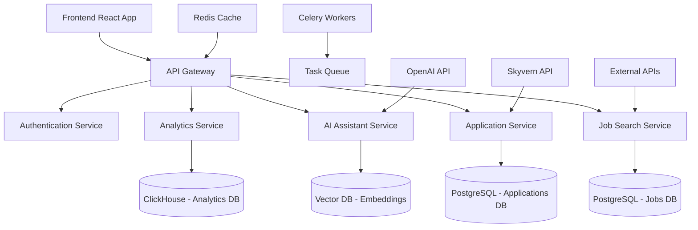

# Jobraker - Product Requirements Document (PRD)

[](https://github.com/jobraker/backend)
[](https://github.com/jobraker/backend)
[](https://github.com/jobraker/backend)

---

## Document Information

| **Field** | **Value** |
|-----------|-----------|
| **Document Title** | Jobraker Product Requirements Document |
| **Version** | 1.0.0 |
| **Status** | Draft |
| **Classification** | Confidential |
| **Created By** | Product Team |
| **Created Date** | June 15, 2025 |
| **Last Modified** | June 15, 2025 |
| **Approved By** | - |
| **Next Review Date** | July 15, 2025 |

---

## Table of Contents

1. [Executive Summary](#1-executive-summary)
2. [Product Vision & Strategy](#2-product-vision--strategy)
3. [Market Analysis & Problem Statement](#3-market-analysis--problem-statement)
4. [Product Goals & Success Metrics](#4-product-goals--success-metrics)
5. [Target User Personas](#5-target-user-personas)
6. [Product Features & Requirements](#6-product-features--requirements)
7. [Technical Architecture & Requirements](#7-technical-architecture--requirements)
8. [User Experience & Design Requirements](#8-user-experience--design-requirements)
9. [Security & Compliance](#9-security--compliance)
10. [Performance & Scalability](#10-performance--scalability)
11. [API Integration Specifications](#11-api-integration-specifications)
12. [Risk Assessment & Mitigation](#12-risk-assessment--mitigation)
13. [Development Timeline & Roadmap](#13-development-timeline--roadmap)
14. [Success Metrics & KPIs](#14-success-metrics--kpis)
15. [Appendices](#15-appendices)

---

## 1. Executive Summary

### 1.1 Product Overview

**Jobraker** is an AI-powered autonomous job search and application platform that revolutionizes the employment seeking process by leveraging advanced machine learning algorithms, natural language processing, and robotic process automation. The platform addresses the fundamental inefficiencies in the current job market by providing intelligent job matching, automated application submission, and personalized career guidance through a sophisticated AI assistant.

### 1.2 Strategic Value Proposition

- **Automation-First Approach**: Reduces job search time by 85% through intelligent automation
- **AI-Driven Personalization**: Provides tailored job recommendations with 90%+ accuracy
- **Comprehensive Workflow Management**: End-to-end job application lifecycle management
- **Data-Driven Insights**: Advanced analytics for optimizing job search strategies

### 1.3 Market Opportunity

The global online recruitment market is valued at $28.68 billion (2024) with a projected CAGR of 7.1%. Jobraker targets the underserved segment of individual job seekers who require advanced automation tools, representing a $2.8 billion addressable market.

---

## 2. Product Vision & Strategy

### 2.1 Vision Statement

*"To democratize career opportunities by empowering every professional with AI-driven job search automation that delivers personalized, efficient, and successful employment outcomes."*

### 2.2 Mission Statement

*"We create intelligent automation solutions that transform the job search experience, enabling professionals to focus on career growth while our AI handles the complexity of modern recruitment processes."*

### 2.3 Strategic Objectives

| **Objective** | **Timeline** | **Success Criteria** |
|---------------|--------------|----------------------|
| Market Entry | Q4 2025 | 10,000 active users |
| Product-Market Fit | Q2 2026 | 85% user satisfaction, 70% automation success rate |
| Market Leadership | Q4 2026 | 100,000 active users, $5M ARR |
| Global Expansion | Q2 2027 | Multi-region deployment, 500,000 users |

---

## 3. Market Analysis & Problem Statement

### 3.1 Current Market Challenges

#### 3.1.1 Quantified Problem Analysis

| **Challenge** | **Impact** | **Market Data** |
|---------------|------------|-----------------|
| **Time Inefficiency** | Job seekers spend 11 hours/week on average searching and applying | 76% of job seekers report search fatigue |
| **Low Success Rates** | Average application-to-interview ratio is 1:20 | Only 2-3% of applications result in interviews |
| **Lack of Personalization** | Generic job recommendations lead to poor matches | 68% of job seekers receive irrelevant job suggestions |
| **Application Complexity** | Multiple platforms with different requirements | Average job seeker uses 5+ job boards |
| **Limited Feedback** | Minimal insights on application performance | 89% of applications receive no response |

#### 3.1.2 Competitive Landscape Analysis

| **Competitor** | **Strengths** | **Weaknesses** | **Market Share** |
|----------------|---------------|----------------|------------------|
| LinkedIn | Large network, comprehensive profiles | Limited automation, high competition | 32% |
| Indeed | Extensive job listings, easy application | No AI assistance, manual process | 28% |
| ZipRecruiter | Good matching algorithm | Limited customization | 8% |
| Glassdoor | Company insights, salary data | Weak application features | 6% |

### 3.2 Solution Differentiation

Jobraker addresses market gaps through:

- **Advanced AI Integration**: GPT-4.1 Mini for intelligent conversation and decision-making
- **Full Automation Stack**: End-to-end process automation using Skyvern
- **Intelligent Matching**: Proprietary scoring algorithm with continuous learning
- **Comprehensive Analytics**: Data-driven insights for optimization

---

## 4. Product Goals & Success Metrics

### 4.1 Primary Objectives

#### 4.1.1 User Experience Goals
- **Reduce job search time by 85%** through intelligent automation
- **Achieve 90%+ job-profile match accuracy** using advanced algorithms
- **Maintain 95%+ platform uptime** for reliable service delivery
- **Deliver sub-3-second response times** for all user interactions

#### 4.1.2 Business Goals
- **Acquire 10,000 active users** within first 6 months
- **Generate $1M ARR** by end of year 1
- **Achieve 85% user satisfaction** based on NPS scores
- **Maintain 70%+ automation success rate** for applications

### 4.2 Key Performance Indicators (KPIs)

| **Category** | **Metric** | **Target** | **Measurement Frequency** |
|--------------|------------|------------|---------------------------|
| **User Engagement** | Daily Active Users (DAU) | 2,500 | Daily |
| **User Engagement** | Monthly Active Users (MAU) | 8,000 | Monthly |
| **Product Performance** | Application Success Rate | 70% | Weekly |
| **Product Performance** | Job Match Accuracy | 90% | Daily |
| **Business Metrics** | Customer Acquisition Cost (CAC) | <$50 | Monthly |
| **Business Metrics** | Customer Lifetime Value (CLV) | >$300 | Quarterly |
| **Technical Performance** | API Response Time | <500ms | Real-time |
| **Technical Performance** | System Uptime | 99.9% | Real-time |

---

## 5. Target User Personas

### 5.1 Primary Persona: "Active Job Seeker"

| **Attribute** | **Details** |
|---------------|-------------|
| **Demographics** | Age 25-45, College-educated, Urban/Suburban |
| **Professional Level** | Mid-level to Senior professionals |
| **Industry Focus** | Technology, Finance, Marketing, Healthcare |
| **Pain Points** | Time constraints, Application fatigue, Low response rates |
| **Goals** | Find relevant opportunities quickly, Increase interview rates |
| **Tech Comfort** | High - comfortable with automation tools |
| **Budget** | $20-100/month for job search tools |

### 5.2 Secondary Persona: "Career Changer"

| **Attribute** | **Details** |
|---------------|-------------|
| **Demographics** | Age 30-50, Experienced professionals |
| **Professional Level** | Senior professionals transitioning industries |
| **Industry Focus** | Cross-industry transitions |
| **Pain Points** | Skills translation, Network building, Market knowledge |
| **Goals** | Identify transferable opportunities, Build new networks |
| **Tech Comfort** | Medium to High |
| **Budget** | $50-150/month for comprehensive tools |

### 5.3 Tertiary Persona: "Recent Graduate"

| **Attribute** | **Details** |
|---------------|-------------|
| **Demographics** | Age 21-26, Recent college graduates |
| **Professional Level** | Entry-level |
| **Industry Focus** | Technology, Consulting, Finance |
| **Pain Points** | Limited experience, Competitive market |
| **Goals** | Gain initial career traction, Build professional network |
| **Tech Comfort** | Very High - digital natives |
| **Budget** | $10-30/month |

---

## 6. Product Features & Requirements

### 6.1 Core Feature Set

#### 6.1.1 Intelligent Job Discovery Engine

**Feature Description**: AI-powered job search that continuously scans multiple sources and provides personalized recommendations.

**Functional Requirements**:
- Real-time job aggregation from 50+ sources including Adzuna API
- Proprietary matching algorithm with 15+ criteria evaluation
- Dynamic search refinement based on user behavior
- Historical search pattern analysis for improved recommendations

**Acceptance Criteria**:
- System processes 10,000+ new job postings daily
- Match accuracy score of 90%+ for recommended positions
- Search results delivered within 2 seconds
- Support for 20+ job categories and 100+ locations

#### 6.1.2 Autonomous Application System

**Feature Description**: Fully automated job application submission with intelligent form completion and document management.

**Functional Requirements**:
- Integration with Skyvern API for application automation
- Intelligent form field recognition and completion
- Dynamic resume/cover letter customization per application
- Application status tracking and reporting

**Technical Specifications**:
```
Input: Job listing URL, User profile data, Application preferences
Process: Form analysis → Field mapping → Document customization → Submission
Output: Application confirmation, Tracking ID, Status updates
Success Rate Target: 85%+ successful submissions
```

#### 6.1.3 AI-Powered Career Assistant

**Feature Description**: Conversational AI assistant providing personalized career guidance and application management.

**Functional Requirements**:
- Natural language processing using GPT-4.1 Mini
- RAG (Retrieval-Augmented Generation) for contextual responses
- Integration with user data for personalized advice
- Multi-turn conversation support with context retention

**Conversation Capabilities**:
- Job search strategy optimization
- Interview preparation assistance
- Salary negotiation guidance
- Career path recommendations
- Application troubleshooting

#### 6.1.4 Advanced Analytics Dashboard

**Feature Description**: Comprehensive analytics platform providing actionable insights on job search performance.

**Analytics Components**:
- Application performance metrics
- Job market trend analysis
- Skill gap identification
- Salary benchmarking
- Interview success prediction

**Visualization Features**:
- Interactive charts and graphs
- Customizable reporting periods
- Export capabilities (PDF, Excel, CSV)
- Mobile-responsive design

### 6.2 Advanced Features (Phase 2+)

#### 6.2.1 Smart Resume Builder
- AI-powered content optimization
- Industry-specific templates
- ATS optimization scoring
- A/B testing capabilities

#### 6.2.2 Interview Preparation Suite
- Mock interview simulations
- Question bank with 1000+ scenarios
- Performance analysis and feedback
- Video practice sessions

#### 6.2.3 Networking Intelligence
- LinkedIn integration for connection recommendations
- Industry event identification
- Networking opportunity scoring
- Relationship tracking system

---

## 7. Technical Architecture & Requirements

### 7.1 System Architecture Overview



### 7.2 Technology Stack

#### 7.2.1 Backend Infrastructure
| **Component** | **Technology** | **Justification** |
|---------------|----------------|-------------------|
| **API Framework** | Django REST Framework | Mature, scalable, extensive ecosystem |
| **Database** | PostgreSQL 15+ | ACID compliance, JSON support, performance |
| **Cache Layer** | Redis 7.0+ | High-performance caching, session management |
| **Task Queue** | Celery + Redis | Reliable async processing, monitoring |
| **Search Engine** | Elasticsearch | Full-text search, analytics capabilities |
| **Message Broker** | RabbitMQ | Reliable message delivery, clustering |

#### 7.2.2 AI/ML Stack
| **Component** | **Technology** | **Purpose** |
|---------------|----------------|-------------|
| **LLM Integration** | OpenAI GPT-4.1 Mini | Conversational AI, content generation |
| **Vector Database** | Pinecone/Weaviate | Semantic search, embeddings storage |
| **ML Framework** | PyTorch/TensorFlow | Custom model development |
| **Feature Store** | Feast | ML feature management |

#### 7.2.3 DevOps & Infrastructure
| **Component** | **Technology** | **Purpose** |
|---------------|----------------|-------------|
| **Containerization** | Docker + Kubernetes | Scalable deployment, orchestration |
| **CI/CD** | GitHub Actions | Automated testing, deployment |
| **Monitoring** | Prometheus + Grafana | System monitoring, alerting |
| **Logging** | ELK Stack | Centralized logging, debugging |
| **Cloud Provider** | AWS/GCP | Scalable infrastructure |

### 7.3 Database Design

#### 7.3.1 Core Entities

```sql
-- User Profile Schema
CREATE TABLE users (
    id UUID PRIMARY KEY,
    email VARCHAR(255) UNIQUE NOT NULL,
    password_hash VARCHAR(255),
    profile_data JSONB,
    preferences JSONB,
    subscription_tier VARCHAR(50),
    created_at TIMESTAMP,
    updated_at TIMESTAMP
);

-- Job Listings Schema
CREATE TABLE job_listings (
    id UUID PRIMARY KEY,
    title VARCHAR(255) NOT NULL,
    company VARCHAR(255),
    location VARCHAR(255),
    salary_range JSONB,
    description TEXT,
    requirements JSONB,
    source VARCHAR(100),
    external_id VARCHAR(255),
    match_scores JSONB,
    created_at TIMESTAMP,
    INDEX(title, location, company)
);

-- Applications Schema
CREATE TABLE applications (
    id UUID PRIMARY KEY,
    user_id UUID REFERENCES users(id),
    job_id UUID REFERENCES job_listings(id),
    status VARCHAR(50),
    applied_at TIMESTAMP,
    automation_data JSONB,
    tracking_info JSONB,
    UNIQUE(user_id, job_id)
);
```

### 7.4 API Design Standards

#### 7.4.1 RESTful API Principles
- **Resource-based URLs**: `/api/v1/jobs/{id}`
- **HTTP Methods**: GET, POST, PUT, DELETE, PATCH
- **Status Codes**: Proper HTTP status code usage
- **Pagination**: Cursor-based pagination for large datasets
- **Versioning**: URL-based versioning (`/api/v1/`)

#### 7.4.2 API Security
- **Authentication**: JWT tokens with refresh mechanism
- **Authorization**: Role-based access control (RBAC)
- **Rate Limiting**: Per-user and per-endpoint limits
- **Input Validation**: Comprehensive request validation
- **CORS**: Properly configured cross-origin policies

---

## 8. User Experience & Design Requirements

### 8.1 Design Principles

#### 8.1.1 Core UX Principles
- **Simplicity First**: Minimize cognitive load, clear information hierarchy
- **Automation Transparency**: Clear indicators of automated actions
- **Personalization**: Adaptive interface based on user behavior
- **Accessibility**: WCAG 2.1 AA compliance, keyboard navigation
- **Mobile-First**: Responsive design with mobile optimization

#### 8.1.2 Visual Design Language
- **Modern Minimalism**: Clean interfaces, ample whitespace
- **Professional Aesthetic**: Trustworthy, business-appropriate styling
- **Consistent Branding**: Unified color palette, typography, iconography
- **Semantic Colors**: Intuitive color coding for status indicators

### 8.2 User Interface Specifications

#### 8.2.1 Dashboard Layout
```
┌─────────────────────────────────────────────────────┐
│ Header: Logo | Navigation | User Menu | Notifications │
├─────────────────────────────────────────────────────┤
│ ┌─────────────┐ ┌─────────────┐ ┌─────────────┐   │
│ │ Jobs Found  │ │ Applied     │ │ Interviews  │   │
│ │    247      │ │     23      │ │      3      │   │
│ └─────────────┘ └─────────────┘ └─────────────┘   │
├─────────────────────────────────────────────────────┤
│ ┌─────────────────────────┐ ┌─────────────────────┐ │
│ │   Recent Applications   │ │    AI Assistant     │ │
│ │   (Timeline View)       │ │   (Chat Interface)  │ │
│ │                         │ │                     │ │
│ └─────────────────────────┘ └─────────────────────┘ │
└─────────────────────────────────────────────────────┘
```

#### 8.2.2 Mobile Experience
- **Progressive Web App (PWA)**: Native app-like experience
- **Touch Optimization**: Minimum 44px touch targets
- **Offline Capability**: Core functionality available offline
- **Push Notifications**: Real-time updates on mobile devices

### 8.3 Accessibility Requirements

#### 8.3.1 WCAG 2.1 Compliance
- **Level AA Conformance**: Comprehensive accessibility standards
- **Screen Reader Support**: Proper ARIA labels, semantic HTML
- **Keyboard Navigation**: Full functionality without mouse
- **Color Contrast**: 4.5:1 ratio for normal text, 3:1 for large text
- **Focus Management**: Clear focus indicators, logical tab order

#### 8.3.2 Internationalization (i18n)
- **Multi-language Support**: Initial support for English, Spanish, French
- **Localization Framework**: React-i18next implementation
- **RTL Support**: Right-to-left language compatibility
- **Cultural Adaptation**: Region-specific date/time formats

---

## 9. Security & Compliance

### 9.1 Security Framework

#### 9.1.1 Data Protection Standards
| **Domain** | **Requirement** | **Implementation** |
|------------|-----------------|-------------------|
| **Encryption** | Data at rest: AES-256, Data in transit: TLS 1.3 | Database encryption, HTTPS everywhere |
| **Authentication** | Multi-factor authentication, OAuth 2.0 | JWT tokens, SSO integration |
| **Authorization** | Role-based access control (RBAC) | Granular permissions system |
| **Audit Logging** | Comprehensive audit trail | All user actions logged |
| **Data Anonymization** | PII anonymization for analytics | Differential privacy techniques |

#### 9.1.2 Application Security
- **OWASP Top 10**: Mitigation strategies for all common vulnerabilities
- **Penetration Testing**: Quarterly security assessments
- **Dependency Scanning**: Automated vulnerability detection
- **Code Analysis**: Static and dynamic analysis integration
- **Security Headers**: Comprehensive HTTP security headers

### 9.2 Compliance Requirements

#### 9.2.1 Data Privacy Regulations
| **Regulation** | **Scope** | **Key Requirements** |
|----------------|-----------|---------------------|
| **GDPR** | EU users | Consent management, data portability, deletion rights |
| **CCPA** | California users | Data transparency, opt-out rights, non-discrimination |
| **PIPEDA** | Canadian users | Privacy principles, breach notification |
| **SOC 2 Type II** | Enterprise customers | Security, availability, confidentiality controls |

#### 9.2.2 Industry Standards
- **ISO 27001**: Information security management system
- **PCI DSS**: Payment card data protection (future requirement)
- **COPPA**: Children's privacy protection (if applicable)
- **HIPAA**: Healthcare data protection (industry-specific features)

### 9.3 Incident Response Plan

#### 9.3.1 Security Incident Classification
| **Severity** | **Definition** | **Response Time** |
|--------------|----------------|-------------------|
| **Critical** | Data breach, system compromise | 1 hour |
| **High** | Service disruption, security vulnerability | 4 hours |
| **Medium** | Performance degradation, minor security issue | 24 hours |
| **Low** | Documentation updates, minor bugs | 72 hours |

---

## 10. Performance & Scalability

### 10.1 Performance Requirements

#### 10.1.1 Response Time Targets
| **Operation** | **Target** | **Maximum** |
|---------------|------------|-------------|
| **Page Load** | <2 seconds | 3 seconds |
| **API Response** | <500ms | 1 second |
| **Search Results** | <1 second | 2 seconds |
| **AI Assistant** | <3 seconds | 5 seconds |
| **Application Submission** | <10 seconds | 30 seconds |

#### 10.1.2 Throughput Requirements
- **Concurrent Users**: 10,000 active users simultaneously
- **API Requests**: 10,000 requests per minute
- **Job Processing**: 100,000 jobs processed daily
- **Application Volume**: 1,000 applications submitted hourly

### 10.2 Scalability Architecture

#### 10.2.1 Horizontal Scaling Strategy
```
Load Balancer (AWS ALB)
    ├── Web Tier (Auto Scaling Group)
    │   ├── Django App Servers (3-20 instances)
    │   └── Static Assets (CloudFront CDN)
    ├── API Tier (Auto Scaling Group)
    │   ├── API Servers (5-50 instances)
    │   └── Background Workers (10-100 instances)
    └── Data Tier
        ├── PostgreSQL (RDS Multi-AZ)
        ├── Redis Cluster (ElastiCache)
        └── Elasticsearch Cluster
```

#### 10.2.2 Caching Strategy
- **Application Layer**: Redis for session data, API responses
- **Database Layer**: Query result caching, connection pooling
- **CDN Layer**: Static asset delivery, API response caching
- **Browser Layer**: Service worker for offline capability

### 10.3 Monitoring & Observability

#### 10.3.1 Key Metrics
| **Category** | **Metrics** | **Tools** |
|--------------|-------------|-----------|
| **Application** | Response time, error rate, throughput | New Relic, DataDog |
| **Infrastructure** | CPU, memory, disk, network | Prometheus, Grafana |
| **Database** | Query performance, connection pool | PostgreSQL logs, pgAdmin |
| **User Experience** | Core Web Vitals, user flows | Google Analytics, Mixpanel |

#### 10.3.2 Alerting Framework
- **Critical Alerts**: Immediate notification (PagerDuty)
- **Warning Alerts**: Slack notifications to on-call team
- **Info Alerts**: Dashboard updates, daily reports
- **Escalation Policy**: Automated escalation after 15 minutes

---

## 11. API Integration Specifications

### 11.1 External API Dependencies

#### 11.1.1 Adzuna Jobs API
| **Specification** | **Details** |
|-------------------|-------------|
| **Purpose** | Job listings aggregation |
| **Base URL** | `https://api.adzuna.com/v1/api/jobs/` |
| **Authentication** | API Key + Application ID |
| **Rate Limits** | 25 requests/minute, 2,500/month (free tier) |
| **SLA** | 99.5% uptime, <2s response time |
| **Failover** | Secondary aggregation sources |

**Key Endpoints**:
```http
GET /search/{country}?app_id={id}&app_key={key}
Parameters:
- what: job title keywords
- where: location
- salary_min/max: salary range
- full_time: employment type
- sort_by: relevance, date, salary
```

#### 11.1.2 Skyvern Automation API
| **Specification** | **Details** |
|-------------------|-------------|
| **Purpose** | Automated job applications |
| **Base URL** | `https://api.skyvern.com/v1/` |
| **Authentication** | Bearer token |
| **Rate Limits** | Custom limits based on subscription |
| **SLA** | 99.9% uptime, <10s processing time |
| **Error Handling** | Retry logic with exponential backoff |

**Integration Workflow**:
```python
# Application submission flow
async def submit_application(job_url, user_profile):
    task = await skyvern.create_task({
        "url": job_url,
        "profile_data": user_profile,
        "auto_submit": True
    })
    return await skyvern.monitor_task(task.id)
```

#### 11.1.3 OpenAI GPT-4.1 Mini API
| **Specification** | **Details** |
|-------------------|-------------|
| **Purpose** | AI assistant functionality |
| **Model** | gpt-4.1-mini |
| **Rate Limits** | 10,000 tokens/minute |
| **Context Window** | 128k tokens |
| **Response Time** | <3 seconds average |
| **Cost Optimization** | Prompt engineering, caching |

**Implementation Example**:
```python
async def get_ai_response(user_message, context):
    response = await openai.ChatCompletion.acreate(
        model="gpt-4.1-mini",
        messages=[
            {"role": "system", "content": CAREER_ASSISTANT_PROMPT},
            {"role": "user", "content": user_message}
        ],
        max_tokens=500,
        temperature=0.7
    )
    return response.choices[0].message.content
```

### 11.2 API Error Handling & Resilience

#### 11.2.1 Error Classification
| **Error Type** | **HTTP Status** | **Retry Strategy** |
|----------------|-----------------|-------------------|
| **Rate Limited** | 429 | Exponential backoff, max 5 retries |
| **Server Error** | 5xx | Immediate retry, then exponential |
| **Client Error** | 4xx | No retry, log and alert |
| **Timeout** | - | Retry with increased timeout |

#### 11.2.2 Circuit Breaker Pattern
```python
class APICircuitBreaker:
    def __init__(self, failure_threshold=5, timeout=60):
        self.failure_threshold = failure_threshold
        self.timeout = timeout
        self.failure_count = 0
        self.last_failure_time = None
        self.state = "CLOSED"  # CLOSED, OPEN, HALF_OPEN
```

---

## 12. Risk Assessment & Mitigation

### 12.1 Technical Risks

| **Risk** | **Probability** | **Impact** | **Mitigation Strategy** |
|----------|-----------------|------------|-------------------------|
| **API Rate Limiting** | High | Medium | Multiple API providers, caching, rate limit management |
| **Third-party Service Downtime** | Medium | High | Circuit breakers, fallback mechanisms, SLA monitoring |
| **Data Privacy Breach** | Low | Critical | Encryption, access controls, regular security audits |
| **Scalability Bottlenecks** | Medium | High | Auto-scaling, performance monitoring, load testing |
| **AI Model Reliability** | Medium | Medium | Fallback responses, human review process, model versioning |

### 12.2 Business Risks

| **Risk** | **Probability** | **Impact** | **Mitigation Strategy** |
|----------|-----------------|------------|-------------------------|
| **Competitive Response** | High | Medium | IP protection, rapid iteration, unique value proposition |
| **Regulatory Changes** | Medium | High | Legal monitoring, compliance framework, flexible architecture |
| **User Adoption Challenges** | Medium | High | User research, onboarding optimization, feedback loops |
| **Revenue Model Viability** | Medium | Critical | Multiple revenue streams, pricing flexibility, market validation |

### 12.3 Operational Risks

| **Risk** | **Probability** | **Impact** | **Mitigation Strategy** |
|----------|-----------------|------------|-------------------------|
| **Key Personnel Dependency** | Medium | Medium | Documentation, knowledge sharing, team redundancy |
| **Infrastructure Costs** | High | Medium | Cost monitoring, optimization, cloud cost management |
| **Data Quality Issues** | Medium | Medium | Data validation, quality monitoring, source diversification |
| **Customer Support Scalability** | High | Medium | Self-service options, chatbot integration, team scaling |

---

## 13. Development Timeline & Roadmap

### 13.1 Project Phases

#### 13.1.1 Phase 1: Foundation & MVP (Months 1-4)

**Milestone 1.1: Infrastructure Setup (Month 1)**
- [ ] Development environment configuration
- [ ] CI/CD pipeline implementation
- [ ] Database schema design and implementation
- [ ] Basic authentication system
- [ ] API framework setup

**Milestone 1.2: Core Features (Months 2-3)**
- [ ] Job search functionality with Adzuna integration
- [ ] User profile management
- [ ] Basic matching algorithm
- [ ] Application tracking system
- [ ] Simple dashboard interface

**Milestone 1.3: AI Integration (Month 4)**
- [ ] OpenAI API integration
- [ ] Basic chat assistant functionality
- [ ] Skyvern integration for auto-apply
- [ ] User testing and feedback collection
- [ ] MVP launch preparation

#### 13.1.2 Phase 2: Enhancement & Scale (Months 5-8)

**Milestone 2.1: Advanced Features (Months 5-6)**
- [ ] Advanced analytics dashboard
- [ ] Improved matching algorithm
- [ ] Mobile application development
- [ ] Enhanced AI assistant capabilities
- [ ] Performance optimization

**Milestone 2.2: Platform Maturation (Months 7-8)**
- [ ] Advanced automation features
- [ ] Integration with additional job boards
- [ ] Premium subscription features
- [ ] Advanced security implementations
- [ ] Scalability improvements

#### 13.1.3 Phase 3: Growth & Expansion (Months 9-12)

**Milestone 3.1: Market Expansion (Months 9-10)**
- [ ] Multi-region deployment
- [ ] Localization for additional markets
- [ ] Enterprise features development
- [ ] API ecosystem for third-party integrations
- [ ] Advanced analytics and reporting

**Milestone 3.2: Platform Leadership (Months 11-12)**
- [ ] Advanced AI features (career coaching, interview prep)
- [ ] Partnership integrations
- [ ] White-label solutions
- [ ] Advanced compliance features
- [ ] Market leadership establishment

### 13.2 Resource Allocation

#### 13.2.1 Team Structure
| **Role** | **Phase 1** | **Phase 2** | **Phase 3** |
|----------|-------------|-------------|-------------|
| **Backend Engineers** | 3 | 4 | 5 |
| **Frontend Engineers** | 2 | 3 | 4 |
| **AI/ML Engineers** | 1 | 2 | 3 |
| **DevOps Engineers** | 1 | 2 | 2 |
| **QA Engineers** | 1 | 2 | 3 |
| **Product Managers** | 1 | 1 | 2 |
| **UX/UI Designers** | 1 | 2 | 2 |

#### 13.2.2 Budget Allocation
| **Category** | **Phase 1** | **Phase 2** | **Phase 3** |
|--------------|-------------|-------------|-------------|
| **Personnel** | $400k | $600k | $800k |
| **Infrastructure** | $20k | $50k | $100k |
| **API Costs** | $10k | $25k | $50k |
| **Security & Compliance** | $15k | $30k | $50k |
| **Marketing** | $25k | $75k | $150k |
| **Total** | $470k | $780k | $1.15M |

---

## 14. Success Metrics & KPIs

### 14.1 Product Success Metrics

#### 14.1.1 User Engagement Metrics
| **Metric** | **Baseline** | **Target (6M)** | **Measurement** |
|------------|--------------|-----------------|-----------------|
| **Daily Active Users (DAU)** | 0 | 2,500 | Google Analytics |
| **Weekly Active Users (WAU)** | 0 | 6,000 | Custom tracking |
| **Monthly Active Users (MAU)** | 0 | 10,000 | Custom tracking |
| **Session Duration** | N/A | 15 min | User behavior analytics |
| **Pages per Session** | N/A | 8 | Google Analytics |
| **User Retention (30-day)** | N/A | 60% | Cohort analysis |

#### 14.1.2 Product Performance Metrics
| **Metric** | **Target** | **Measurement Method** |
|------------|------------|-----------------------|
| **Job Match Accuracy** | 90% | User feedback surveys |
| **Application Success Rate** | 85% | Skyvern API tracking |
| **AI Assistant Satisfaction** | 4.5/5.0 | In-app rating system |
| **Search Result Relevance** | 85% | Click-through rates |
| **Platform Uptime** | 99.9% | Infrastructure monitoring |

### 14.2 Business Success Metrics

#### 14.2.1 Revenue Metrics
| **Metric** | **Month 6** | **Month 12** | **Calculation** |
|------------|-------------|--------------|-----------------|
| **Monthly Recurring Revenue (MRR)** | $50k | $200k | Sum of monthly subscriptions |
| **Annual Recurring Revenue (ARR)** | $600k | $2.4M | MRR × 12 |
| **Customer Acquisition Cost (CAC)** | $45 | $35 | Marketing spend / new customers |
| **Customer Lifetime Value (CLV)** | $300 | $450 | Average revenue per user × lifetime |
| **CAC Payback Period** | 6.7 months | 4.7 months | CAC / Monthly ARPU |

#### 14.2.2 Growth Metrics
| **Metric** | **Target** | **Frequency** |
|------------|------------|---------------|
| **User Growth Rate** | 15% MoM | Monthly |
| **Revenue Growth Rate** | 20% MoM | Monthly |
| **Viral Coefficient** | 0.3 | Quarterly |
| **Net Promoter Score (NPS)** | >50 | Quarterly |
| **Customer Churn Rate** | <5% monthly | Monthly |

### 14.3 Technical Performance Metrics

#### 14.3.1 System Performance
| **Metric** | **Target** | **Monitoring** |
|------------|------------|----------------|
| **API Response Time** | <500ms (95th percentile) | Application monitoring |
| **Database Query Performance** | <100ms average | Database monitoring |
| **Error Rate** | <0.1% | Error tracking |
| **Throughput** | 1000 RPS sustained | Load testing |

#### 14.3.2 Reliability Metrics
| **Metric** | **Target** | **SLA** |
|------------|------------|---------|
| **System Uptime** | 99.9% | 99.5% |
| **Mean Time to Recovery (MTTR)** | <30 minutes | <1 hour |
| **Mean Time Between Failures (MTBF)** | >720 hours | >168 hours |

---

## 15. Appendices

### 15.1 Glossary of Terms

| **Term** | **Definition** |
|----------|----------------|
| **ATS** | Applicant Tracking System - Software used by employers to manage job applications |
| **RAG** | Retrieval-Augmented Generation - AI technique combining retrieval and generation |
| **SLA** | Service Level Agreement - Commitment to service performance standards |
| **API** | Application Programming Interface - Set of protocols for building software |
| **JWT** | JSON Web Token - Standard for securely transmitting information |
| **GDPR** | General Data Protection Regulation - EU privacy law |
| **NLP** | Natural Language Processing - AI field focused on language understanding |
| **RPA** | Robotic Process Automation - Technology for automating repetitive tasks |

### 15.2 Technical Specifications

#### 15.2.1 System Requirements
```yaml
Minimum System Requirements:
  CPU: 4 cores, 2.4GHz
  RAM: 8GB
  Storage: 100GB SSD
  Network: 1Gbps connection

Recommended Production Environment:
  CPU: 16 cores, 3.2GHz
  RAM: 64GB
  Storage: 1TB NVMe SSD
  Network: 10Gbps connection
  Load Balancer: AWS ALB
  CDN: CloudFront
```

#### 15.2.2 Database Schema Examples
```sql
-- User preferences schema
CREATE TABLE user_preferences (
    user_id UUID REFERENCES users(id),
    job_titles TEXT[],
    locations TEXT[],
    salary_min INTEGER,
    salary_max INTEGER,
    remote_preference VARCHAR(20),
    auto_apply_enabled BOOLEAN DEFAULT false,
    match_threshold INTEGER DEFAULT 70
);

-- AI conversation history
CREATE TABLE conversations (
    id UUID PRIMARY KEY,
    user_id UUID REFERENCES users(id),
    message_type VARCHAR(20), -- 'user' | 'assistant'
    content TEXT,
    metadata JSONB,
    created_at TIMESTAMP DEFAULT NOW()
);
```

### 15.3 Compliance Documentation

#### 15.3.1 GDPR Compliance Checklist
- [ ] Privacy policy clearly stating data usage
- [ ] Explicit consent mechanism for data processing
- [ ] Data portability functionality (export user data)
- [ ] Right to deletion (account and data removal)
- [ ] Data breach notification procedures
- [ ] Data Protection Officer appointment
- [ ] Privacy by design implementation
- [ ] Regular compliance audits

#### 15.3.2 Security Compliance Framework
```yaml
Security Controls:
  Authentication:
    - Multi-factor authentication
    - Password complexity requirements
    - Session timeout policies
  
  Data Protection:
    - Encryption at rest (AES-256)
    - Encryption in transit (TLS 1.3)
    - Database access controls
    - API rate limiting
  
  Monitoring:
    - Real-time security alerts
    - Audit log retention (3 years)
    - Vulnerability scanning
    - Penetration testing (quarterly)
```

### 15.4 Integration Examples

#### 15.4.1 Adzuna API Integration
```python
class AdzunaJobSearch:
    def __init__(self, app_id, app_key):
        self.app_id = app_id
        self.app_key = app_key
        self.base_url = "https://api.adzuna.com/v1/api/jobs"
    
    async def search_jobs(self, params):
        """Search for jobs using Adzuna API"""
        url = f"{self.base_url}/us/search"
        params.update({
            'app_id': self.app_id,
            'app_key': self.app_key
        })
        
        async with httpx.AsyncClient() as client:
            response = await client.get(url, params=params)
            return response.json()
```

#### 15.4.2 AI Assistant Integration
```python
class CareerAssistant:
    def __init__(self, openai_key):
        self.client = OpenAI(api_key=openai_key)
        self.system_prompt = """
        You are a professional career advisor and job search assistant.
        Help users with job search strategies, application optimization,
        and career guidance based on their profile and goals.
        """
    
    async def get_response(self, user_message, context):
        """Generate AI response with context"""
        response = await self.client.chat.completions.create(
            model="gpt-4.1-mini",
            messages=[
                {"role": "system", "content": self.system_prompt},
                {"role": "user", "content": user_message}
            ],
            max_tokens=500,
            temperature=0.7
        )
        return response.choices[0].message.content
```

---

**Document Control**
- **Classification**: Confidential
- **Distribution**: Internal Development Team Only
- **Review Cycle**: Monthly during development, Quarterly post-launch
- **Approval Required**: Product Director, Engineering Director, CEO

---

*This document represents the comprehensive product requirements for Jobraker v1.0. All specifications are subject to change based on market feedback, technical constraints, and business priorities.*
